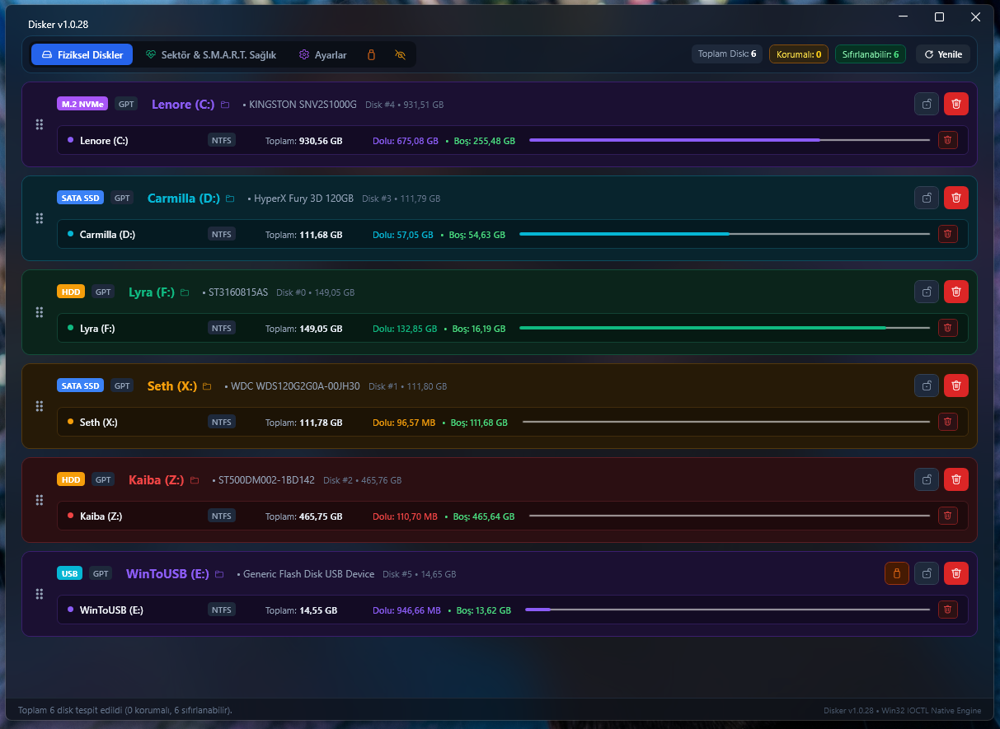
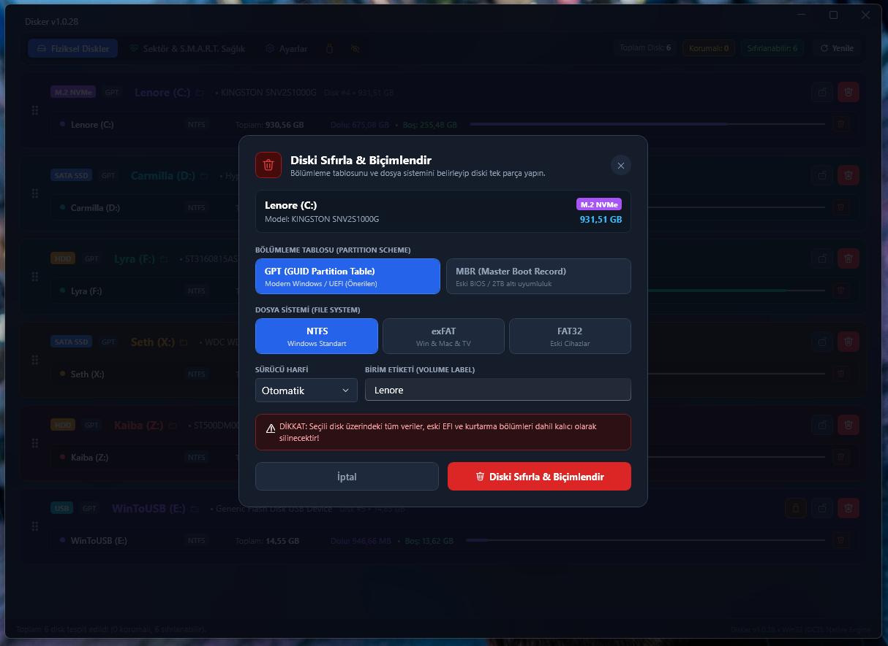
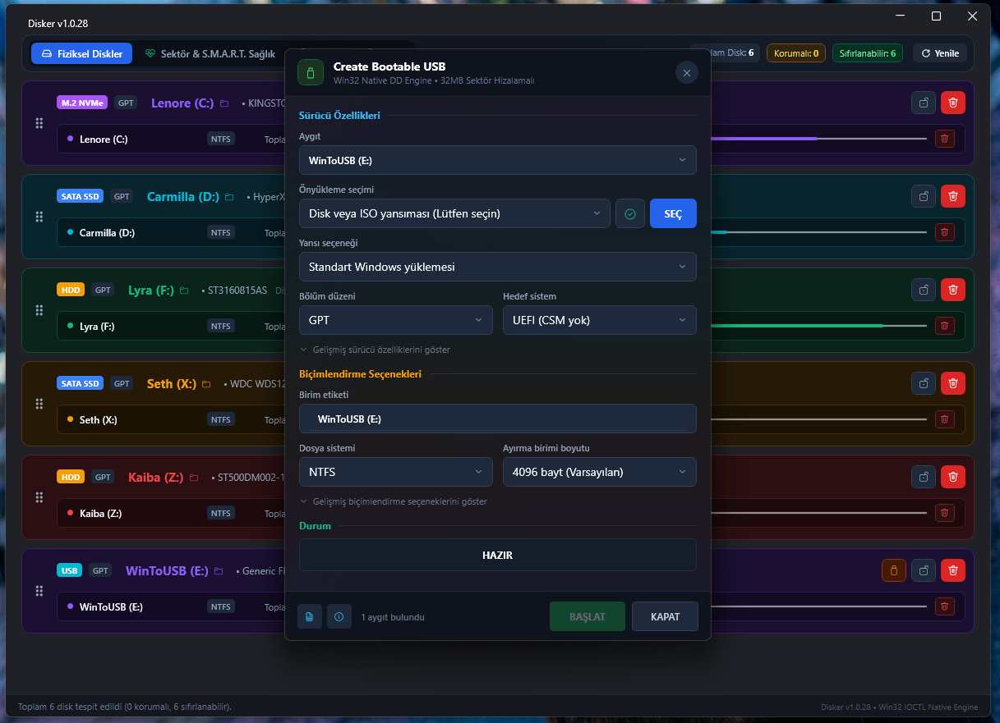
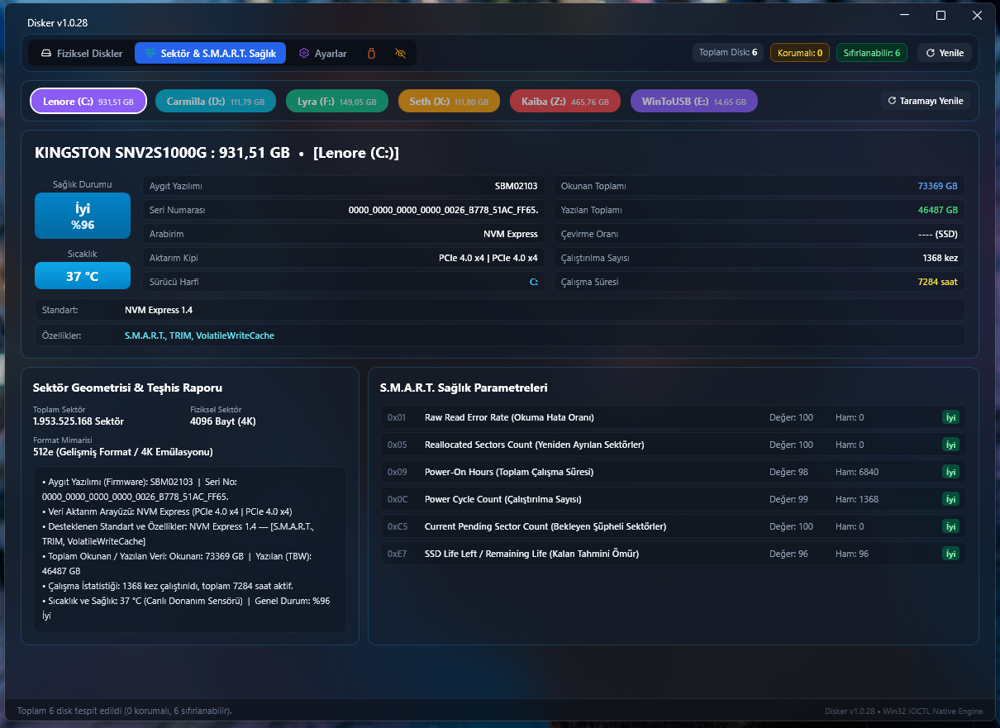
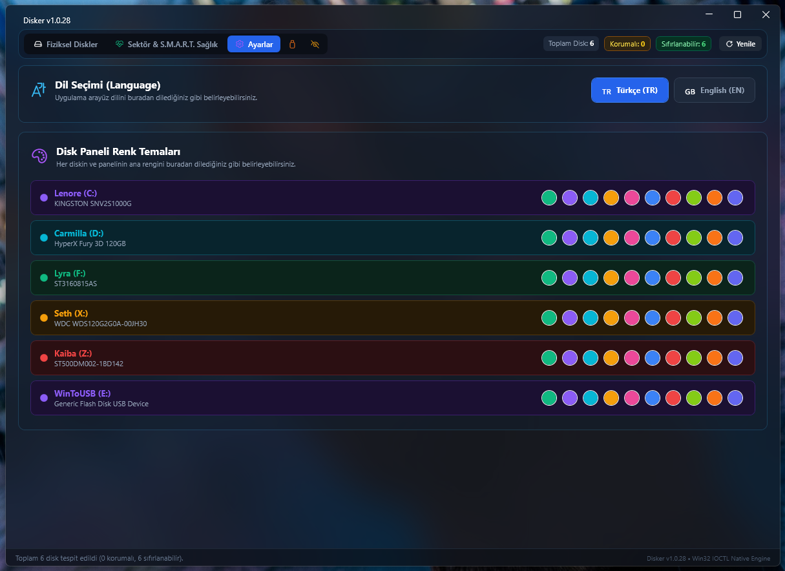

# 💽 Disker — Modern Windows 11 Disk Manager & ISO USB Flasher

<p align="center">
  
</p>

<p align="center">
  <b>Windows için Modern, Akıcı, Güvenli Disk Yönetimi ve Rufus Motorlu ISO Bootable USB Yazıcı</b>
</p>

<p align="center">
  
  
  
  
</p>

---

## 📸 Ekran Görüntüleri (Screenshots)

### 1. Ana Disk ve Bölüm Yönetimi (Fiziksel Diskler)
Canlı renk kodlu disk kartları, sürükle-bırak sıralama, akıllı donanım tespiti (NVMe, SSD, HDD, USB) ve tek tıkla koruma kilidi:


### 2. Modern Dahili Sıfırlama ve Biçimlendirme Modalı
Bölümleme tablosu (GPT/MBR), dosya sistemi (NTFS/exFAT/FAT32) ve sürücü harfi yapılandırması:


### 3. ISO → Bootable USB Yazıcı (Create Bootable USB)
Rufus Win32 DD mimarisinden esinlenen tam teşekküllü, sektör hizalamalı ham imaj yazıcı:


### 4. S.M.A.R.T. Sağlık ve Sektör Teşhisi
Gerçek zamanlı sıcaklık, tahmini sağlık skoru, RAW S.M.A.R.T. parametreleri ve sektör geometrisi:


### 5. Özelleştirilebilir Renk Temaları ve Dil Ayarları
10 farklı canlı disk renk paleti ve anında çift dilli (TR / EN) arayüz:


---

## ✨ Temel Özellikler (Features)

- **🎨 Windows 11 Fluent Dark Tasarım:** Modern kart yapısı, 10 farklı canlı disk renk paleti ve akıcı animasyonlar.
- **🛡️ Akıllı Güvenlik Koruması (Safety Guard):** `C:` Windows sistem diski ve kullanıcının kilitlediği diskler silme/formatlama işlemlerine karşı donanımsal düzeyde kilitlenir. Koruma durumu oturumlar arasında kalıcıdır.
- **🚀 Create Bootable USB (Rufus DD Motoru):**
  - USB bellek tespiti ve otomatik hedef seçimi.
  - Windows ISO'ları için Standart Yükleme / Windows To Go desteği.
  - GPT (UEFI) ve MBR (BIOS) bölüm düzeni seçenekleri.
  - SHA-256 sağlama toplamı (Checksum) hesaplama.
  - 32MB sektör hizalı Win32 `FILE_FLAG_NO_BUFFERING` canlı yazma motoru.
- **↕️ Canlı Sürükle-Bırak Sıralama:** Disk kartlarını istediğiniz öncelik sırasına göre serbestçe sürükleyip bırakın (sınır korumalı ve animasyonlu).
- **👁️ Akıllı Sistem Bölümü Gizleme:** Göz ikonu ile küçük EFI bootloader, MSR ve kurtarma alanlarını tek tıkla gizleyin veya açın.
- **🌐 Çift Dil Desteği:** Tek tıkla anında Türkçe ve İngilizce arasında geçiş.
- **🔢 Otomatik Derleme Sayacı:** Her derlemede otomatik artan build ve versiyon takibi (`v1.0.X`).

---

## 🛠️ Mimari & Teknolojiler

- **Çatı:** .NET 8 (C# 12)
- **Arayüz:** WPF (Windows Presentation Foundation), [WPF-UI](https://github.com/lepoco/wpfui) Fluent v3.0.5
- **MVVM:** `CommunityToolkit.Mvvm` (Source Generators)
- **Veri Sağlayıcı:** WMI (`Win32_DiskDrive`, `Win32_DiskPartition`, `MSFT_PhysicalDisk`) + Win32 P/Invoke IOCTLs

---

## 🚀 Derleme & Çalıştırma

### Gereksinimler:
- Windows 10 (Build 19041+) veya Windows 11
- .NET 8.0 SDK

### Derleme:
```powershell
dotnet build "src/Disker.WpfUi/Disker.WpfUi.csproj" -c Release
```

### Çalıştırma:
```powershell
Start-Process "src/Disker.WpfUi/bin/ReleaseNew/Release/net8.0-windows10.0.19041.0/DiskerApp.exe"
```

---

## 📄 Lisans
Bu proje [MIT Lisansı](LICENSE) altında lisanslanmıştır.
